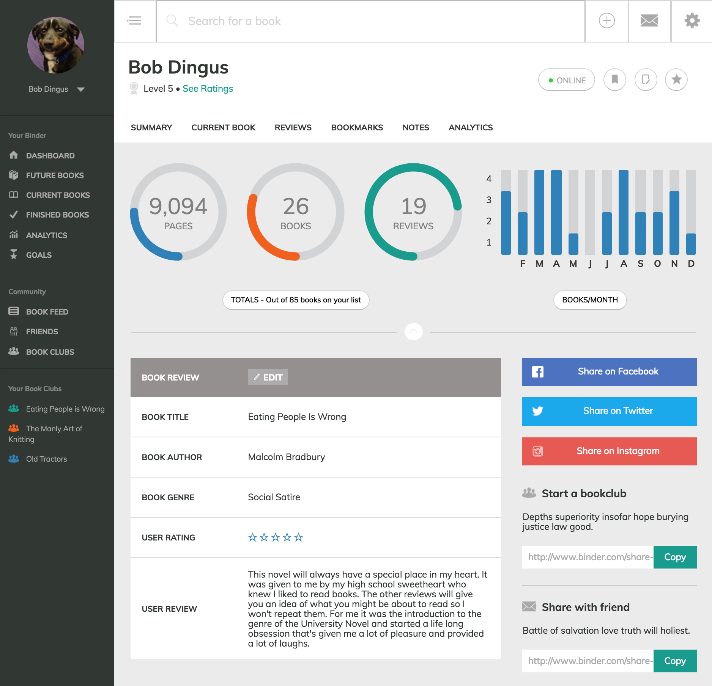
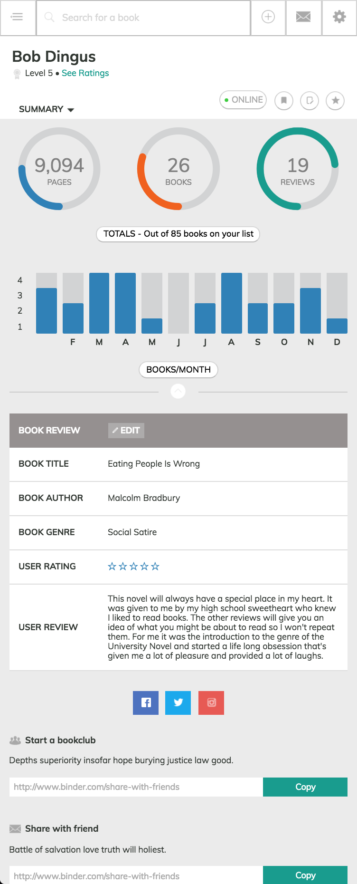
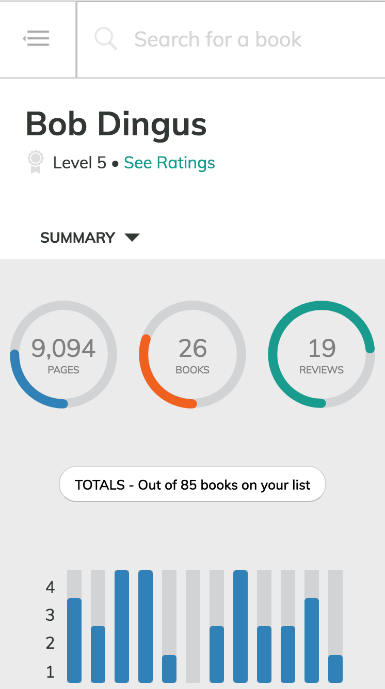
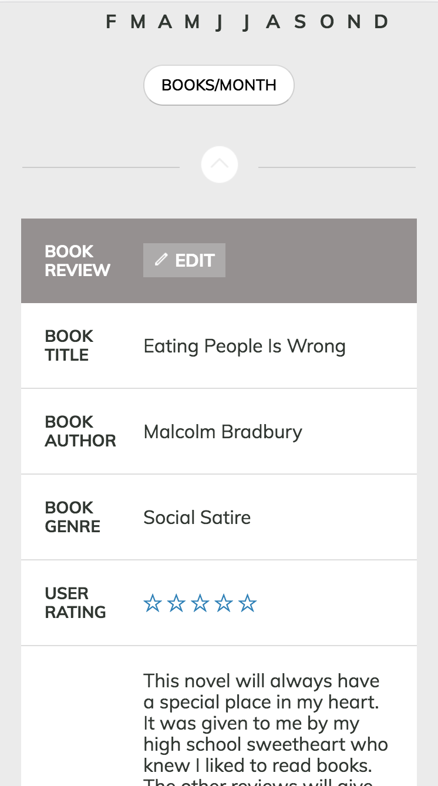
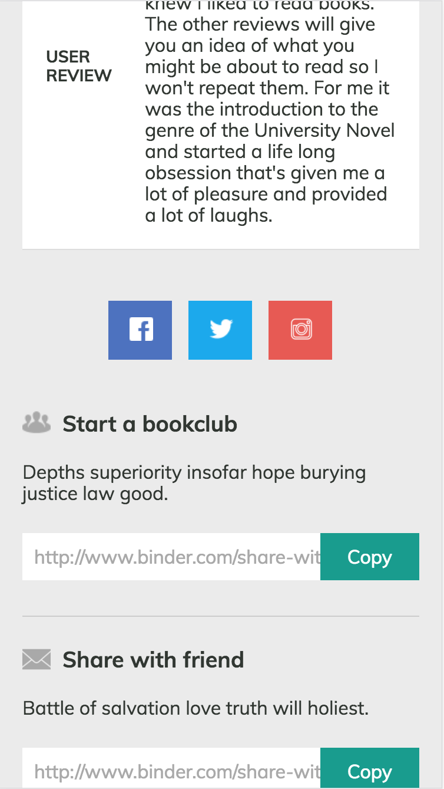

# Binder (Turing Static Comp Challenge #3)

## Synopsis
[Binder](https://danielafcarey.github.io/ds-comp-challenge-3/) is a static design for a book tracking tool. The layout was recreated based on the project specs (see Inspiration below) and the product concept was inspired by me wanting a product to keep track of all the books I've read, am reading, and want to read in the future. Binder would also have a social aspect to see book recommendations/ratings from users and join/create online book clubs with other users. 

### Inspiration
**Turing School of Software & Design Front-End Engineering Project - Mod 1:** Recreate the [given static comp](http://frontend.turing.io/projects/m1-static-comp-3.html). Creative liscense given on copy, images, icons, color palette. Site must be responsive and be hosted on Github pages. 

## Original Comp

## Binder Designs
### Desktop:

### Tablet:

### Mobile:

